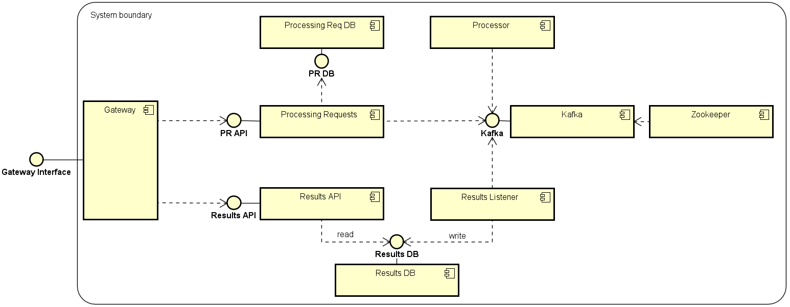

# Sate Processing Server

A very simple and distributed server to process data and get the results.

For now, it really doesn't process anything real, but with some work, it would :)


## Architecture




### Processing Requests

Provides a ReST API (built in Flask) to create _Processing Requests_ and _Executions_:

 * A Processing Request contains the definition of the inputs.
 * An Execution is an attempt of executing a Processing Request.

Uses _Processing Requests DB_ for persistence. It keeps two collections: One for
Processing Requests, and another for Executions.

When an Execution is created, it is published to an _Apache Kafka_ topic.


### Processing Requests DB

A _MongoDB_ instance.


### Kafka and Zookeeper
An Apache Kafka instance, and a Zookeeper instance.


### Processor

Consumes executions from an Apache Kafka topic, processes them, and publishes
the execution results into 3 different Kafka topics, depending on whether the 
execution was successful or not:
 * If the execution was successful, it publishes the results to a topic
    of successful executions.
 * If the execution failed, it publishes the results to a topic of failed
    executions.
 * If the message from the inbound topic couldn't be parsed, or an unexpected
    error occurred, it publishes the results to a dead letter queue topic.


### Results Listener

Consumes the Kafka topics of successful and failed executions, and saves the
results into _Results DB_. It is the only service that writes to that database.


### Results DB

Yet another _MongoDB_ instance.


### Results API

Provides a ReST API (built in Flask) to query the results of an specific
Processing Request or Execution. It is the only service that reads from
that database.


### Gateway

The single entry-point to the System. Provides a ReST API (built in Flask)
to:
 * Create a Processing Request.
 * Create an Execution (of a Processing Request).
 * Query the results of a Processing Request.
 * Query the results of an Execution.

Thanks to the Gateway, all internal components are kept really simple. The
Gateway adds some behaviour that implies multiple internal components, and 
by doing so, they are completely decoupled from each other.

Behavior of the Gateway:
 * Prevents having multiple Executions of the same Processing Request running
    at the same time. When someone tries to create an Execution, and there is
    an active Execution of that Processing Request, then the Gateway will 
    reply with an error and explain the situation.
 * Makes sure that the Processing Request is not processed successfully 
    multiple times. So, if there's already a successful execution of that 
    Processing Request, it will reply with an error, explain the situation, 
    and provide an URI to query the results.
 * Of course, Processing Requests can be retried if its Executions failed.
    But a maximum count of failures is allowed. So, if that threshold is
    reached, it would:
    1. Reject any attempt of creating new Executions of that Processing Request.
    1. All attempts of creating new Executions of that Processing Request are
        published to the Dead Letter Queue topic in Kafka.


## How to Use

### Set Up

These are the steps to start the server in your environment:
 1. You'll need _Docker_ and _Docker Compose_. And, depending on how your 
    environment is configured, you may need root privileges.

 1. Well, of course, clone the repo:
 
    ```bash
    git clone https://github.com/gabrielbazan/sate.git 
    ```

 1. Go into the repo directory:
 
    ```bash
    cd sate/
    ```

 1. Build the images:
 
    ```bash
    docker-compose build
    ```

 1. Start the containers:
 
    ```bash
    docker-compose up
    ```
    
    Or, if you want to run them in detached mode:
 
    ```bash
    docker-compose up -d
    ```

 1. Aaand that's it! You have everything running now.
 
 1. To stop the containers:
 
    ```bash
    docker-compose down
    ```


### Use the API

By default, the Gateway is available in the port _5003_ of the host.

We'll go through the very basic endpoints.


#### Create a Processing Request

Just perform an HTTP request with:
 * URI: http://127.0.0.1:5003/requests
 * HTTP method: POST
 * Content-type: application/json

Request body example:
```json
{
    "payload": {
        "message": "ping",
        "parameterA": "valueA",
        "parameterB": false,
        "parameterC": ["abc", "xyz"],
        "parameterD": {
          "d1": 1,
          "d2": 2
        }
    }
}
```

The only required property is "payload". Yo can put anything you want inside it.

Example response to the example request body:
```json
{
    "id": "722c5951-50b9-4dd1-b84b-2f4c6fc38635",
    "payload": {
        "message": "ping",
        "parameterA": "valueA",
        "parameterB": false,
        "parameterC": [
            "abc",
            "xyz"
        ],
        "parameterD": {
            "d1": 1,
            "d2": 2
        }
    }
}
```

It just adds the "id" property, with the unique identifier of the Processing
Request. This identifier is the one we'll use in other endpoints to execute
it, and query its results.


#### Execute a Processing Request (create an Execution)

Just perform an HTTP request with:
 * URI: http://127.0.0.1:5003/requests/<processing_request_id>/executions
 * HTTP method: POST
 * Content-type: application/json

Request body example, to simulate an execution error:
```json
{
    "force_error": true
}
```

Request body example, to simulate a successful execution:
```json
{
    "force_error": false
}
```

Example response to the example request body:
```json
{
    "id": "60e8d09b-7a8d-4580-a6d2-200708e56e7a",
    "force_error": true,
    "creation_date": "2020-11-07 16:31:58.103057",
    "processing_request": {
        "id": "1be8f5ad-9472-4daf-89db-ce6484449940",
        "payload": {
            "message": "ping",
            "parameterA": "valueA",
            "parameterB": false,
            "parameterC": [
                "abc",
                "xyz"
            ],
            "parameterD": {
                "d1": 1,
                "d2": 2
            }
        }
    }
}
```

It wraps the Processing Request object into the Execution object, which has
its own properties, such as:
 * **id**: Unique identifier of the Execution.
 * **force_error**: Whether to simulate an error or not.
 * **creation_date**: When it was created.


#### Query Results

After the Execution is create, the _Processor_ service will simulate some execution
time, after which you can query the results through this endpoint.

Just perform an HTTP request with:
 * URI: http://127.0.0.1:5003/requests/<processing_request_id>/results
 * HTTP method: GET

Example response:
```json
{
    "results": [
        {
            "id": "c1626f00-39a9-4e62-9625-718e38508310",
            "is_success": false,
            "processing_start_time": "2020-11-07 16:26:04.319542",
            "processing_end_time": "2020-11-07 16:26:14.329619",
            "processing_total_seconds": 10.010077,
            "outputs": {},
            "execution": {
                "creation_date": "2020-11-07 16:31:58.103057",
                "force_error": true,
                "id": "60e8d09b-7a8d-4580-a6d2-200708e56e7a",
                "processing_request": {
                    "id": "1be8f5ad-9472-4daf-89db-ce6484449940",
                    "payload": {
                        "message": "ping",
                        "parameterA": "valueA",
                        "parameterB": false,
                        "parameterC": [
                            "abc",
                            "xyz"
                        ],
                        "parameterD": {
                            "d1": 1,
                            "d2": 2
                        }
                    }
                }
            }
        },
        {
            "id": "597d4679-1ad5-4799-88ca-dbcd28550ba6",
            "is_success": true,
            "processing_start_time": "2020-11-07 16:54:14.434825",
            "processing_end_time": "2020-11-07 16:54:24.441799",
            "processing_total_seconds": 10.006974,
            "outputs": {
                "message": "pong"
            },
            "execution": {
                "creation_date": "2020-11-07 16:32:18.234057",
                "force_error": false,
                "id": "70d8d872-ee03-4bfd-bea6-18a3b8c08393",
                "processing_request": {
                    "id": "1be8f5ad-9472-4daf-89db-ce6484449940",
                    "payload": {
                        "message": "ping",
                        "parameterA": "valueA",
                        "parameterB": false,
                        "parameterC": [
                            "abc",
                            "xyz"
                        ],
                        "parameterD": {
                            "d1": 1,
                            "d2": 2
                        }
                    }
                }
            }
        }
    ]
}
```

As you can notice, the "results" key contains a list of objects. Each object is
what we call a "result". A result is an object that wraps the Execution object,
and has its own properties:
 * **id**: Unique identifier of the result;
 * **is_success**: Whether if the result corresponds to a failed execution or not.
 * **processing_start_time**: When the execution started in the _Processor_ service.
 * **processing_end_time**: When the execution ended in the _Processor_ service.
 * **processing_total_seconds**: How many seconds took to the _Processor_ service
    to process the execution.
 * **outputs**: Outputs of the execution. If the execution failed, there are no 
    outputs. If it was successful, some outputs are simulated.
